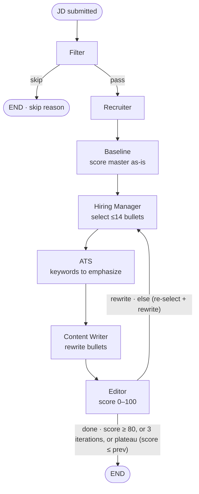
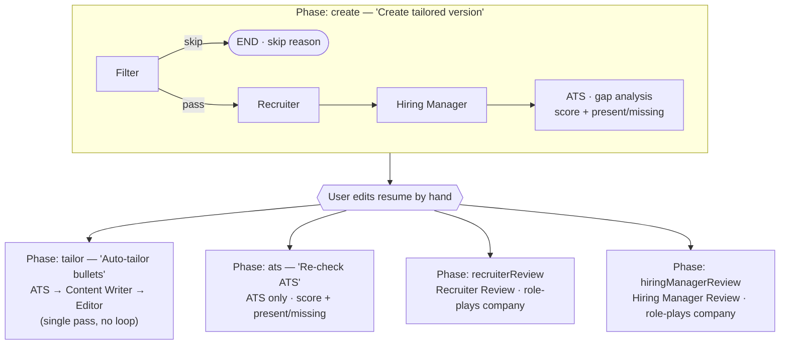

# Resume Builder

A resume-tailoring app. You keep one master resume (work, projects, bullets,
skills); the app tailors it to a job description through a multi-agent LangGraph
workflow, saves named versions per company, and exports a one-page PDF.

## Stack

- Frontend: Vite + React 19 SPA (`react-router-dom`), Tailwind v4 + shadcn-style
  components. Inter for the UI, Calibri in the resume preview.
- Backend: Vercel serverless functions in `/api` (`@vercel/node`), deployed with
  the static SPA.
- Data: Supabase Postgres with Row-Level Security; Google OAuth via Supabase Auth.
- Tailoring: LangGraph.js. The LLM is user-provided (any Anthropic or
  OpenAI-compatible provider); there is no server LLM.

Run locally with `vercel dev`, which serves the SPA and `/api` together. Plain
`npm run dev` (Vite only) does not serve the API routes.

## Data model

Normalized tables: `profiles`, `education`, `work`, `work_bullets`, `projects`,
`project_bullets`, `skills`, plus `resume_versions` and `user_llm_keys` (below).
Each bullet has:

- `original_text` — canonical master content.
- `text` — current/tailored content (may contain inline `<b>…</b>` bolding).

Selection state: `projects.is_selected`, `skills.is_selected`,
`*_bullets.is_excluded`, and `position` for ordering. RLS on every table:
`profile_id = auth.uid()` (bullets check ownership through their parent).

Migrations are in `supabase/migrations/`. Two of them (`20260701120000`,
`20260701120100`) add the drifted `is_selected`/`is_excluded` columns
idempotently and create `resume_versions`; `20260715120000` creates the
`user_llm_keys` vault.

### Data-safety guards

Tailoring reads `original_text` as the master. If a bullet's `original_text` is
blank, the graph falls back to its current `text` (self-heal), and apply never
writes empty text over existing content (`api/analyze.ts`), so a thin or empty
model response can't blank the resume. Per-bullet "restore original" (↺) resets
`text` back to `original_text`.

## Version management

A resume version is a named snapshot of the tailored state, not the master.
`resume_versions` stores three JSONB columns keyed by row id/category:

- `projects_state` — `[{ id, is_selected, position }]`
- `bullets_state` — `[{ id, kind: 'work'|'project', text, is_excluded, position }]`
- `skills_state` — `[{ category, items, position, is_selected }]`

The data layer is `src/utils/versions.ts` (client-side supabase-js, RLS-scoped):
`listVersions`, `getVersion`, `saveVersion`, `loadVersion`, `renameVersion`,
`duplicateVersion`, `deleteVersion`. Loading a version overlays the tailored
columns back onto the current rows; `original_text` is never touched. Versions
are manual-only — nothing is auto-snapshotted on tailoring. UI is in
`src/components/VersionBar.tsx`.

## Agentic tailoring (`/api/analyze` + `api/tailoring-graph.ts`)

The tailoring endpoint is a 6-node LangGraph workflow exposed through two modes.
Each node is one focused LLM call.

- Filter — hard-blocker check against `filter-rules.md`; terminates early on skip.
- Recruiter — 6-second fit read (first impression, verdict, working-for, gaps, role type).
- Baseline — scores the untailored master (default selection, master text) against the JD, so the UI can show the before/after lift.
- Hiring Manager — selects projects/bullets (page-fit ≤14) and skills-row order.
- ATS — keyword coverage. Two prompt roles: keywords to emphasize (writer input)
  vs gap analysis (`atsScore` + present/missing), depending on the phase.
- Content Writer — rewrites included bullets with JD framing + `<b>` bolding.
- Editor — QA (page-fit, honesty, em dashes, bolding) that scores the draft 0–100.

### Quick mode — one autonomous run

`src/components/JDAnalysisTab.tsx` POSTs `{ stream: true }` (no `phase`) and the
server streams live per-agent progress over SSE (`runTailoringGraphStreaming` →
the compiled graph). The Editor loops back to the Hiring Manager (which then
re-runs ATS → Content Writer → Editor) so its feedback can fix selection and
ordering, not just wording, until the score clears the bar or the run
plateaus/caps out.



Thresholds from `tailoring-graph.ts`: `SCORE_THRESHOLD = 80`,
`MAX_EDITOR_ITERATIONS = 3` (Content Writer runs up to 3 times, i.e. up to 2
rewrites). Plateau = the latest score did not beat the previous pass.

### Guided mode — user-triggered phases

`src/components/GuidedTailor.tsx` drives the same agents as discrete phases the
user triggers by hand, editing the resume in between. The `tailor` phase does
not loop — it runs ATS → Content Writer → Editor once (the Editor score is
informational, not a gate). The two review agents role-play the named company
and run on the current resume view, not the master.



Master as starting point: the master resume is the base agents generate from,
not a ceiling. To maximize JD fit and ATS score, agents add relevant skills,
tools, and keywords from the JD — including ones not in the master — woven into
the existing experience. There is no separate "skills honesty" list.

Prompt caching: the three guidance files + the master-resume snapshot form a
shared, cached system prefix across all agents (two `ephemeral` breakpoints);
only per-agent instructions + the JD vary, so agents 2–6 hit the cache.

### Endpoint contract

`POST /api/analyze` with `Authorization: Bearer <supabase jwt>`.

```jsonc
// Preview (runs the graph):
{ "jdText": "…", "profileId": "…", "applyChanges": false }

// Apply (replays the previewed plan — the graph does NOT re-run):
{ "profileId": "…", "applyChanges": true, "plan": { /* the plan from preview */ } }
```

Response `{ plan, applied, usage }`. The `plan` (also the object the frontend
renders) carries per-agent reasoning:

```jsonc
{
  "filterResult": { "skip": false, "reason": "…" },
  "fitAssessment": {
    "firstImpression": "…",
    "verdict": "apply",
    "workingFor": [],
    "gaps": [],
    "roleType": "…",
  },
  "hiringManagerRationale": "…",
  "atsKeywords": ["…"],
  "skills": [
    /* { category, items[], position, is_selected } */
  ],
  "projects": [
    /* { id, is_selected, position, bullets[] } */
  ],
  "work": [
    /* { id, bullets[] } */
  ],
  "notes": ["…"],
  "editorNotes": ["…"],
  "iterations": 1,
}
```

The two-step flow is mandatory — nothing is auto-applied. Preview runs the graph
once; Apply writes the stored plan. If `filterResult.skip` is true, the response
carries only `filterResult` + `notes` and no DB writes happen.

### LLM (user-provided — no server default)

There is no built-in LLM and no server API key. Each user supplies their own
provider, API key, and model in API settings (`ApiSettings.tsx`). The key is
saved once to the encrypted server vault (see below), not kept in the browser;
`/api/analyze` and `/api/parse-resume` load it server-side by verified user id.
With no key configured, both endpoints return `400` asking the user to set one
(`isLLMUsable`).

Both provider families work:

- Anthropic (`provider: "anthropic"`) — native Messages API with ephemeral
  prompt caching across agents.
- OpenAI-compatible (`provider: "openai"`) — any `/chat/completions` endpoint
  (Cerebras, OpenAI, Gemini, Ollama, …) via the user-supplied base URL.

All agents use the single user-provided model.

### Required env vars

Set in `.env` locally and in Vercel project settings (see `.env.example`). The
LLM is user-provided (no LLM env vars), but the key vault needs two server-only
secrets:

| Var                         | Purpose                                                                       |
| --------------------------- | ----------------------------------------------------------------------------- |
| `VITE_SUPABASE_URL`         | Supabase project URL (client and `/api`)                                      |
| `VITE_SUPABASE_ANON_KEY`    | Supabase anon key (also read server-side by `/api`)                           |
| `SUPABASE_SERVICE_ROLE_KEY` | Server-only. Used by `/api/keys` + `/api/account` to touch the locked-down key vault and delete accounts. Never `VITE_`-prefix it. |
| `LLM_KEY_ENC_SECRET`        | Server-only. 32-byte base64 master key (KEK) that wraps each user's per-key DEK. Generate with `node -e "console.log(require('crypto').randomBytes(32).toString('base64'))"`. Changing it makes stored keys undecryptable. |

### RLS / auth

RLS stays enforced. `/api/analyze` connects with the anon key but forwards the
signed-in user's session JWT (`global.headers.Authorization`), so `auth.uid()`
resolves server-side and `profile_id = auth.uid()` policies pass. Missing or
invalid bearer token → `401`.

`user_llm_keys` is the exception: RLS is enabled with no policies and privileges
are revoked from `anon`/`authenticated`, so the browser can never read the
encrypted key material. Only the service role touches it, from `/api/keys` and
`/api/account`, after verifying the caller's JWT.

### Key vault

User API keys never live in the browser:

1. The key is sent to `POST /api/keys` once, over HTTPS.
2. Envelope encryption (AES-256-GCM): a per-user data key (DEK) encrypts the API
   key, and the DEK is wrapped by the server-held master key (`LLM_KEY_ENC_SECRET`).
   Only the ciphertext and wrapped DEK are stored (`api/keyVault.ts`).
3. `/api/analyze` and `/api/parse-resume` load and decrypt the key server-side by
   verified user id; the request body is never trusted for credentials.
4. The key is never returned to the client (`GET /api/keys` reports only
   provider/model). `DELETE /api/keys` revokes it; `DELETE /api/account` cascades
   away all user data including the key.

The browser caches only non-secret status (`resumeBuilder.llmPrefs`) for UI
gating. With the CSP in `vercel.json`, there's no plaintext key in the browser
for an XSS payload to steal.

### Guidance directory (`api/guidance/`)

Three hand-maintained markdown files, loaded at cold start
(`api/guidance-files.ts`) and cached in the prompt:

- `tailoring-principles.md` — formatting, bolding, length targets, skills ordering
- `filter-rules.md` — hard blockers (skip) and soft blockers (apply with framing)
- `career-strategy.md` — visa timeline, role preferences, market context

Bundled via `vercel.json` (`functions["api/analyze.ts"].includeFiles`). Edit and
redeploy; changes apply on the next cold start.

## Resume import (`/api/parse-resume` + `src/utils/masterResume.ts`)

New users onboard by uploading an existing resume. `POST /api/parse-resume`
(Bearer JWT) takes a base64 PDF, extracts its text server-side with `unpdf`
(serverless-friendly, no worker setup), and sends that text to the user's
configured LLM — provider-agnostic. It returns `{ parsed }` in the master schema
(`profile`, `education`, `work[]`, `projects[]`, `skills[]`, bullets as verbatim
strings). It only extracts; the client writes.

`overwriteMasterResume(parsed)` (client, RLS-scoped) then clears and repopulates
`work`/`projects`/`skills`/`education` and updates the `profiles` row
(`original_text = text`, projects/skills `is_selected = true`). Saved company
versions are left intact. Personal fields only overwrite when the parse found a
value.

- Onboarding — `src/routes/Editor.tsx` shows an upload dialog when the master is
  empty (`work`/`projects`/`skills` all empty on Master, not a version);
  `ResumeUpload` handles read → parse → write, then refreshes.
- Re-upload — an "Import from resume" card in `src/routes/Profile.tsx` does the
  same with a confirm prompt (it's destructive to master content).
- Requires a configured LLM. The upload UI blocks with a "set up your LLM"
  message if none is set; the endpoint returns `400` likewise.
- Text-based PDFs only. A scanned/image PDF yields no text → `422`.

## PDF export

Browser-native `window.print()` on the preview iframe. The filename comes from
`document.title`, set to `Resume_{company}.pdf` where `company` is the active
version's `company_name` (spaces → underscores, special chars stripped, fallback
`General`).

## UI layout

Three columns (`src/routes/Editor.tsx`): left = version switcher + Export PDF;
center = editor (Projects/Experience/Skills, collapsible and drag-sortable)
side-by-side with a live auto-scaling preview and a fits/overflows badge; right =
JD input + per-agent reasoning panel (`src/components/JDAnalysisTab.tsx`). Editor
edits autosave via a diff-based writer (`src/utils/api.ts`).
